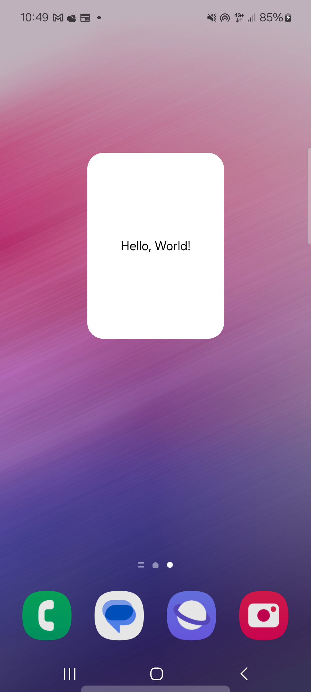

# Create widgets with Jetpack Compose and Glance SDK

With Compose we have the opportunity to write not only the UI of our application but also widgets.

The information in this document is based on the official documentation of Jetpack Compose and [Glance SDK](https://developer.android.com/develop/ui/compose/glance).

To start widget integration with Compose you need to use Glance SDK.
Glance SDK is a library that provides a sub set of Composable functions that can be used to create widgets.

To start using Glance SDK you need to add the following dependency to your project.
Inside your toml file add the following dependencies:

```toml
[versions]
# Other dependencies...
glanceAppwidget = "1.1.0"

[libraries]
# Other dependencies...
androidx-glance = { module = "androidx.glance:glance", version.ref = "glanceAppwidget" }
androidx-glance-appwidget = { module = "androidx.glance:glance-appwidget", version.ref = "glanceAppwidget" }
androidx-glance-material = { module = "androidx.glance:glance-material", version.ref = "glanceAppwidget" }
androidx-glance-material3 = { module = "androidx.glance:glance-material3", version.ref = "glanceAppwidget" }
```

You need to add the following code to your build.gradle file:

```gradle
android{
    ///...

    buildFeatures {
        compose = true
    }

    composeOptions {
        kotlinCompilerExtensionVersion = "1.5.14"
    }

}


dependencies {
    //other dependecies...
    implementation(libs.androidx.glance)
    implementation(libs.androidx.glance.appwidget)
    implementation(libs.androidx.glance.material)
    implementation(libs.androidx.glance.material3)
}
```

Then you are ready to create your first widget.


## Create a simple widget

The first step is to create the most simple widget that you can create, a classic "Hello World".
We need to create a new object that extends the `GlanceAppWidget` class and overrides the `provideGlance` method.

```kotlin
object HelloWorldWidget : GlanceAppWidget() {

    override suspend fun provideGlance(context: Context, id: GlanceId) {
        Log.d("HelloWorldWidget", "provideGlance: id -> $id") // this is our widget identifier
        provideContent {
            Box(
                contentAlignment = Alignment.Center,
                modifier = GlanceModifier.background(color = Color.White).fillMaxSize()
            ) {
                Text("Hello, World!")
            }
        }
    }
}
```

After that, we need to notify the system that our application has a new widget that can be added to the home screen.
To do that we need to create a new class that extends the `GlanceAppWidgetReceiver` class, this class is very important to manage the state of the widgets, this is called on update, on destroy ecc...


```kotlin
class HelloWorldWidgetReceiver : GlanceAppWidgetReceiver() {
    override val glanceAppWidget: GlanceAppWidget = HelloWorldWidget
}
```

Now we need to add the receiver to the AndroidManifest.xml file, in that way the system can recognize our widget.

```xml
 <receiver
            android:name="it.widget.widget.HelloWorldWidgetReceiver"
            android:exported="true">
            <intent-filter>
                <action android:name="android.appwidget.action.APPWIDGET_UPDATE" />
            </intent-filter>
            <meta-data
                android:name="android.appwidget.provider"
                android:resource="@xml/hello_world_widget_info" />
        </receiver>
```

Where `hello_world_widget_info` is a xml file that contains the information about the widget, like the size, the preview ecc... ()

```xml
<appwidget-provider xmlns:android="http://schemas.android.com/apk/res/android"
    android:description="@string/widget_description"
    android:initialLayout="@layout/glance_default_loading_layout"
    android:minWidth="96dp"
    android:minHeight="96dp"
    android:resizeMode="horizontal|vertical"
    android:widgetCategory="home_screen" />
```

The final result will be something like this:




## Create a counter widget

It's important to understand how to update the widget state.
The information displayed by the widget could be saved into the datastore, and retrieved like this:

```kotlin
val count = currentState(key = intPreferencesKey("count")) ?: 0
```

These preferences are saved into the widget context, so they are not shared with the application and **aren't** shared between widgets.
 
So if we want to create a second widget that shows a counter, we can do something like this:

```kotlin
object CounterWidget : GlanceAppWidget() {

    const val KEY_COUNT = "count"
    override suspend fun provideGlance(context: Context, id: GlanceId) {
        Log.d("CounterWidget", "provideGlance: id -> $id") // this is our widget identifier


        provideContent {
            val count = currentState(key = intPreferencesKey(KEY_COUNT)) ?: 0
            Row(
                modifier = GlanceModifier.background(color = Color.White).fillMaxSize().padding(16.dp),
                verticalAlignment = Alignment.CenterVertically
            ) {
                Button(
                    text = "-", onClick = actionRunCallback<ChangeCountAction>(
                        actionParametersOf(ChangeCountAction.countParam to count - 1)
                    )
                )
                Box(
                    modifier = GlanceModifier.defaultWeight(),
                    contentAlignment = Alignment.Center,
                ) {
                    Text(count.toString())
                }
                Button(
                    text = "+", onClick = actionRunCallback<ChangeCountAction>(
                        actionParametersOf(ChangeCountAction.countParam to count + 1)
                    )
                )
            }
        }
    }
}

class ChangeCountAction : ActionCallback {


    companion object {
        val countParam = ActionParameters.Key<Int>("count")

        fun invokeUpdateCounter(context: Context, glanceId: Int, count: Int) {
            val action = ChangeCountAction()
            CoroutineScope(Dispatchers.Main).launch {
                action.onAction(context, GlanceAppWidgetManager(context).getGlanceIdBy(glanceId), actionParametersOf(countParam to count))
            }
        }

    }

    override suspend fun onAction(context: Context, glanceId: GlanceId, parameters: ActionParameters) {
        updateAppWidgetState(context, glanceId) { prefs ->
            prefs[intPreferencesKey(CounterWidget.KEY_COUNT)] = parameters[countParam] ?: 0
        }
        CounterWidget.update(context, glanceId)
    }

}

class CounterWidgetReceiver : GlanceAppWidgetReceiver() {
    override val glanceAppWidget: GlanceAppWidget = CounterWidget

    override fun onUpdate(context: Context, appWidgetManager: AppWidgetManager, appWidgetIds: IntArray) {
        Log.d("ChangeCountAction", "onUpdate: ids -> ${appWidgetIds.joinToString(", ")}")
        super.onUpdate(context, appWidgetManager, appWidgetIds)
    }
}
```

Remember to add the receiver to the **AndroidManifest.xml** file.

As you can see, we have created a new action class called **ChangeCountAction** that will be called when the user clicks on the buttons, this action will update the widget state thanks to the parameter "**count**" that we have passed to the action.
The same action may be called by the application to update the widget state, in this case we need to call the **invokeUpdateCounter** method from the app. To do that, we need to know the glanceId of the widgets that we want to update, **GlanceAppWidgetManager** class comes in help.

To retrieve the glanceId (the **int** value) of the widgets we can use the following method:

```kotlin
    fun getWidgetIds(context: Context, providerClass: Class<*>): IntArray {
        val appWidgetManager = AppWidgetManager.getInstance(context)
        val componentName = ComponentName(context, providerClass)
        val appWidgetIds = appWidgetManager.getAppWidgetIds(componentName)
        return appWidgetIds
    }
```

**Note**: **invokeUpdateCounter** wants a GlanceId as input, with the method `GlanceAppWidgetManager(context).getGlanceIdBy(gId)` we can translate a gId (the integer value) to a glanceId object.

To recap: until now we saw how to create a simple widget and how to update its state, we saw that we can update it from the widget itself or from the application.
In the next section we will see how to communicate between widgets to application, services, and broadcast receivers.


## Send data from the widget to the application

To send data from the widget to the application we have multiple choose.
The main [guide](https://developer.android.com/develop/ui/compose/glance/user-interaction) say that you can use on of the following methods:

* **actionStartActivity** - Start an activity.
* **actionStartService** - Start a service.
* **actionSendBroadcast** - Send a broadcast.

But with these methods I found some problems in settings the data that I want to send to the application, so I decided to create, inside my broadcast, static methods to send data to the application. 
This is good because the static methods can also be used by other classes, not only by the widgets.

So, for this example, I want to create a widget that send to the main application the time when the user clicks on the widget.
As first step we need to create our brodcast receiver:

```kotlin
@OptIn(DelicateCoroutinesApi::class)
class TimeWidgetBroadcastReceiver : BroadcastReceiver() {
    companion object {
        private val Context.dataStore: DataStore<Preferences> by preferencesDataStore(name = "time_widget_datastore")

        const val UPDATE_TIMESTAMP_ACTION = "UPDATE_TIMESTAMP"
        const val TIMESTAMP_EXTRA = "timestamp"


        fun updateTimestamp(context: Context, timestamp: Long) {
            context.sendBroadcast(Intent(context, TimeWidgetBroadcastReceiver::class.java).apply {
                action = "${context.packageName}.${UPDATE_TIMESTAMP_ACTION}"
                putExtra(TIMESTAMP_EXTRA, timestamp)
            })
        }

        fun getTimestamp(context: Context): Flow<Long> {
            return context.dataStore.data.map {
                it[longPreferencesKey("timestamp")] ?: 0
            }
        }
    }


    override fun onReceive(context: Context, intent: Intent) {
        Log.d("TimeWidgetBroadcastReceiver", "onReceive: ${intent.action}")
        if (intent.action == "${context.packageName}.${UPDATE_TIMESTAMP_ACTION}") {
            val timestamp = intent.getLongExtra(TIMESTAMP_EXTRA, 0)
            Log.d("TimeWidgetBroadcastReceiver", "onReceive: timestamp -> $timestamp")
            GlobalScope.launch {
                context.dataStore.edit {
                    it[longPreferencesKey("timestamp")] = timestamp
                }
            }
        }
    }

}
```

This class contains two static methods, one to save the timestamp into **datastore** to the application and one to retrieve it (the best thing is to use datastore into a different class, but for this example I decided to use it here for simplicity).

Then we need to add the receiver to the **AndroidManifest.xml** file:

```xml
<application
   ...
   >
   ...
   <receiver
            android:name="it.widget.widget.receiver.TimeWidgetBroadcastReceiver"
            android:exported="false">
            <intent-filter>
                <action android:name="${applicationId}.UPDATE_TIMESTAMP_ACTION" />
            </intent-filter>
        </receiver>
</application>
```

Where **UPDATE_TIMESTAMP_ACTION** is a constant that contains the action that the broadcast receiver will listen to.

As last step we need to create the widget (remember, you need to register it into the **AndroidManifest.xml** file as we saw in the previous examples):

```kotlin
object TimeButtonWidget : GlanceAppWidget() {

    const val KEY_TS = "timestamp"
    override suspend fun provideGlance(context: Context, id: GlanceId) {
        Log.d("TimeButtonWidget", "provideGlance: id -> $id") // this is our widget identifier


        provideContent {
            val timestamp = currentState(key = longPreferencesKey(KEY_TS)) ?: 0L
            val formatter = SimpleDateFormat("dd-MM-yyyy HH:mm:ss")
            val timeCal = Calendar.getInstance()
            timeCal.timeInMillis = timestamp
            val dateString = formatter.format(timeCal.time)
            Column(
                modifier = GlanceModifier.background(color = Color.White).fillMaxSize().padding(16.dp),
                verticalAlignment = Alignment.CenterVertically,
                horizontalAlignment = Alignment.CenterHorizontally
            ) {
                Box(
                    modifier = GlanceModifier.fillMaxWidth(),
                    contentAlignment = Alignment.Center,
                ) {
                    Button(
                        text = "Send timestamp", onClick = actionRunCallback<UpdateTimestampAction>(
                            actionParametersOf(UpdateTimestampAction.tsParam to System.currentTimeMillis())
                        )
                    )
                }
                Box(
                    modifier = GlanceModifier.fillMaxWidth(),
                    contentAlignment = Alignment.Center,
                ) {
                    Text(if (timestamp != 0L) dateString else "", style = androidx.glance.text.TextStyle(textAlign = TextAlign.Center))
                }
            }

        }
    }
}
```

We are able now to send the timestamp to the application when the user clicks on the button, in a very similar way we could send the timestamp through an intent or a service.

 
## Widgets preview and final considerations

Now that we have a vision of what we can do with widgets, we can talk about some limit the Glance SDK has.
The first limit is that to create a widget preview (the layout displayed inside the widget picker), we need to create a xml layout file, we can't use a composable function to create it.
The second limitations are linked to the layouts that we can create, we can't use all the composable functions that we have in the Jetpack Compose library, we can use only the functions provided by the Glance SDK, this could be a problem if you don't talk about it previously with your UX/UI designer.
Another problem could be that most of these composable have the same name of the Jetpack Compose functions, so you need to pay attention to the import that you are using. To avoid this issue, a solution is to separate the widgets in a different module.
